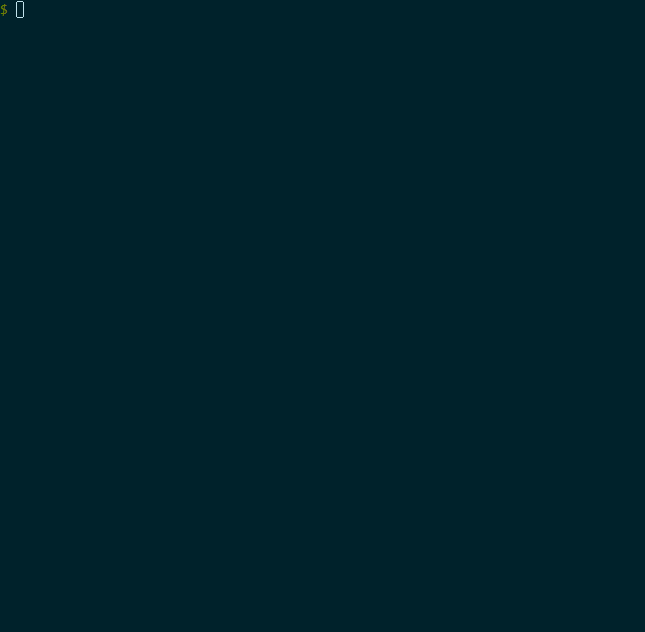

# mutagen

> A powerful, enjoyable, yet lightweight, Genesys toolbox to rely on as part of any
> troubleshooting, testing, support, management, development tasks.

[]()

## Table of Contents

- [Use Cases](#use-cases)
- [Features](#features)
- [Getting Started](#getting-started)
- [Versioning](#versioning)
- [Built With](#built-with)
- [FAQ](#faq)
- [Support](#support)
- [License](#license)

## Use Cases

Here are a few use cases supported by `mutagen`.

- Perform point-in-time configuration snapshot, for one or multiple environments.
- Gain insights about configured Genesys services, including host, port, type, and name
- Compare configuration objects* over time and/or across environments.
- Get Genesys services status.
- Import configuration objects* in a Configuration Server.
- Get agent status.
- Perform agent logout on voice channels.
- Create messages and import audio files in GAX/ARM.

## Features

Here are some feature highlights.

- Cross-platform Support. Works on Windows, Linux, and macOS.
- Multi-Environment Aware. Define Genesys connection settings on a per-environment basis, and easily switch between one another.
- Security in Mind. Supports encrypted TLS connections.
- Embrace Unix philosophy. Supports command composability and machine-friendly input/output.
- Export/Import. Supports configuration objects* and GAX/ARM messages and audios.
- Status queries. Get Genesys service info/status and agent connectivity status.

## Getting Started

### Requirements

#### Java

- `mutagen` requires a Java Development Kit (JDK) version 8 or greater to build.
- `mutagen` requires a Java Runtime Environment (JRE) version 8 or greater to run.

#### Genesys PSDK

A maven repository containing Genesys PSDK 9.0 libraries is also required for `mutagen` to properly build.
The url of this repository must be specified using the `GENESYS_PSDK_MAVEN_URL` environment variable.

### Installation

To release `mutagen`, the following command must be executed.
).

```bash
./gradlew -Pversion=$VERSION release
```

Creates `shadowJar` jar file as well as associated distribution artifacts including standalone
Windows executable from [launch4j](http://launch4j.sourceforge.net/).
Artifacts are then available from `build/launch4j/mutagen.exe` and `build/mutagen` for
Windows and Unix respectively.

The generated executables can then be used anywhere as long as a JRE is available.

### Usage

`mutagen` is a self documenting command line executable.
Simply execute it with no parameters to have a list of available commands and options.

#### Windows

> mutagen.exe

#### Linux

> ./mutagen

#### Environment Configuration

Since `mutagen` relies on connection details to interact with various Genesys endpoints, an environment configuration file needs to be created. This file should be located under $HOME/.mutagen/environments.yml or %USERPROFILE%\.mutagen\environments.yml.  It is also possible to override the default location by either using the $MUTAGEN_HOME variable or simply dropping an environments.yml file in the current working directory.

The following presents a configuration file sample:

    default:
      host: cfgserver.mydomain.com
      user: user
      password: password
      port: 2020
      tls: false
      application: myapp

Notes:
- port, tls, and application are optional, defaulting to 2020, false, and default respectively.
- while password is also optional, it will be prompted for if not present.

## Versioning

We use [SemVer](http://semver.org/) for versioning. For the versions available, see the [tags on this repository](https://github.com/nuecho/mutagen/tags).

## Built With

* [Kotlin](https://kotlinlang.org/) - Programming Language
* [Gradle](https://gradle.org/) - Build System
* [Picocli](https://github.com/remkop/picocli) - CLI Library

## FAQ

> Why does GAX login fails even if I put the proper credentials?

GAX uses a password encryption technique that is not included in `mutagen`.
To make it work, you must generate an encrypted password by trying to log into GAX using the web interface.
Using the correct password with an invalid username and checking the failed login request will get you the encrypted password.
The password can then be put in a file and piped to `stdin` in conjunction with the `-p` switch.

## Support

You can reach the `mutagen` team by email at mutagen@nuecho.com

## License

This project is licensed under the Apache License, Version 2.0 - see the [LICENSE](LICENSE) file for details
